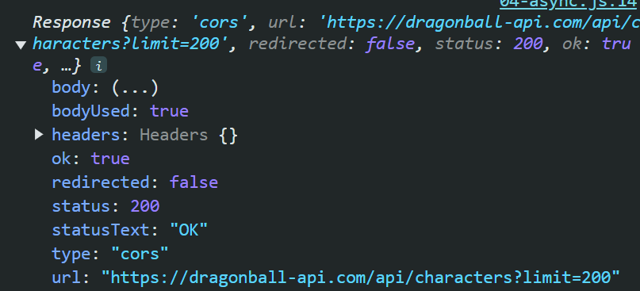

# LAB | DOM Manipulation & API Fetching

This exercise allows you to practice and apply the concepts and techniques taught in class.

Upon completion of this exercise, you will be able to:

- Manipulate the DOM using JavaScript.
- Fetch data from an API and use JavaScript to dynamically update HTML elements.
- Create and style elements using JavaScript.
- Understand how to iterate through data to display multiple items.

## Introduction

In this exercise, you will practice working with the DOM using JavaScript. You will fetch data from an external API, create HTML elements based on the data, and then manipulate the DOM to display those elements on the page.

You will be fetching data from an API that provides character information, including images and names. Your task is to display each character as an HTML list item (`<li>`), and style them using CSS.

## Setup

- Fork this repo
- Clone this repo

```shell
cd lab-dom-api-fetch
npm install
```

## Submission

- Upon completion, run the following commands:

  ```
  git add .
  git commit -m "done"
  git push origin main
  ```

- Create a Pull Request and submit your assignment.

## Instructions

### Iteration 0 | Setting Up

1. Inside the `src/` folder, create a new file named `main.js`.
2. Link `main.js` to `index.html` using a `<script>` tag.
3. Create a folder named `styles` inside `src/` and add a `style.css` file to style the elements you create in the following iterations.

### Iteration 1 | Fetch Characters Data

1. Use the following API to fetch data: `https://dragonball-api.com/api/characters?limit=200`.
2. Make an API call using `fetch()` to get the character data.
3. Make sure you use the async/await syntax.

<details>
  <summary>Example of Fetch 🙈</summary>

Here is an example of how you can use the `fetch` API to get data from an external source:

```javascript
async function fetchData() {
  const response = await fetch("https://example-api.com/characters");
  const data = await response.json();
  console.log(data);
  // Process the data here
}

fetchData();
```

</details>

### Iteration 2 | Create HTML Elements

1. Once you have the data from the API, iterate through the list of characters.
2. For each character, create an HTML list item (`<li>`) element.
3. Each list item should contain:

- The character's image as an `` element.
- The character's name as a `<p>` element.

4. Add a CSS class called `card` to each `<li>` element.

### Iteration 3 | Append to the DOM

1. Find the container element in `index.html` where the characters should be displayed (element with the ID `#characters-list`).
2. Append each newly created `<li>` to the container element.

### Iteration 4 | Style the Elements

1. Use the `card` class to style each character element.
2. Make sure to display the elements in a flex container with `flex-wrap: wrap` to ensure they appear nicely on the page.
3. Add some padding, margin, and background color to each character card to make them look appealing.

### Bonus: Iteration 5 | Loading State

1. Create a "Loading..." message that is displayed while the API request is in progress.
2. Once the data has been successfully fetched, remove the "Loading..." message from the DOM.

### Bonus: Iteration 6 | Error Handling

When we work with async code and API calls, we can encounter errors. Like when the network is down, the API is not available, or the response is empty. To make our application more robust, we should handle these errors.

All the requests we make to APIs are going to send us a response as an object. This object has a property called `ok` that is a boolean. If the request was successful, `ok` will be `true`. If the request failed, `ok` will be `false`.

This is a console.log of the response before being converted to JSON:



Use the `ok` property to check if the request was successful or not.

If the response is not successful, display an error message on the page.

You can test this by adding a random string to the API URL, like this:

```javascript
fetch("https://dragonball-api.com/api/characters?limit=200adsfdsdgsfdgsd")
```

Remember to change it back to the original url! 🤪

## Example of the html structure and css

Your HTML should look something like this:

```html
<ul id="characters-list">
  <!-- JavaScript will add <li> elements here -->
</ul>
```

Your JavaScript will dynamically create `<li>` elements for each character, like this:

```html
<li class="card">
  
  <p>Character Name</p>
</li>
```

And here is a basic CSS example to style the cards:

```css
.card {
  border: 1px solid #ccc;
  padding: 20px;
  margin: 10px;
  width: 150px;
  text-align: center;
}

#characters-list {
  display: flex;
  flex-wrap: wrap;
}
```

**Happy coding!**
